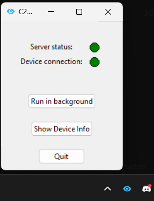

# C2 Security Application Client 

## Introduction
The C2 Security Application Client is a part of a command and control (C2) infrastructure designed to monitor and interact with endpoint devices securely. This client application communicates with the server to receive commands, send device information, and manage watchlist statuses, ensuring devices remain compliant with the monitoring system. It features a graphical user interface (GUI) for user interaction and supports WebSocket communication for real-time command execution.

## Showcase
Below is a screenshot of the application GUI:



## How to Use
### Prerequisites
Before running the application, ensure the following dependencies are installed:

- Python 3.10 or above is required.
- Dependencies: Install them using pip

Install dependencies with:

```bash
python3 -m venv venv
```

```bash
source venv/bin/activate
```

```bash
pip install -r requirements.txt
```

Ensure you have Tkinter installed, as it is required for the GUI. You might need to install it separately depending on your OS.

## Build
The client application does not require a separate build step. Make sure the dependencies are installed, and you have the necessary environment variables set up if required.

## Test
Unit tests can be run using the built-in unittest module. Make sure all dependencies are installed, and then execute:

```bash
python3 -m unittest discover -s tests
```
This will discover and run all available tests and provide a summary of any issues.

## Run
To run the client application:
1. Use a window environment like command prompt or powershell. WSL will work but you do not hav access to the tray.
2. Make sure the server is running and accessible.
3. Execute the following command:

```bash
source venv/bin/activate
```

```bash
python3 client.py
```

The application will start, connect to the server, and the GUI will appear for interaction.

## License
This project is licensed under the MIT License - see the [LICENSE](LICENSE) file for details.
